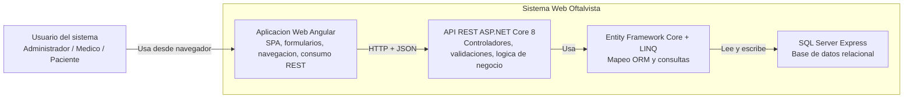
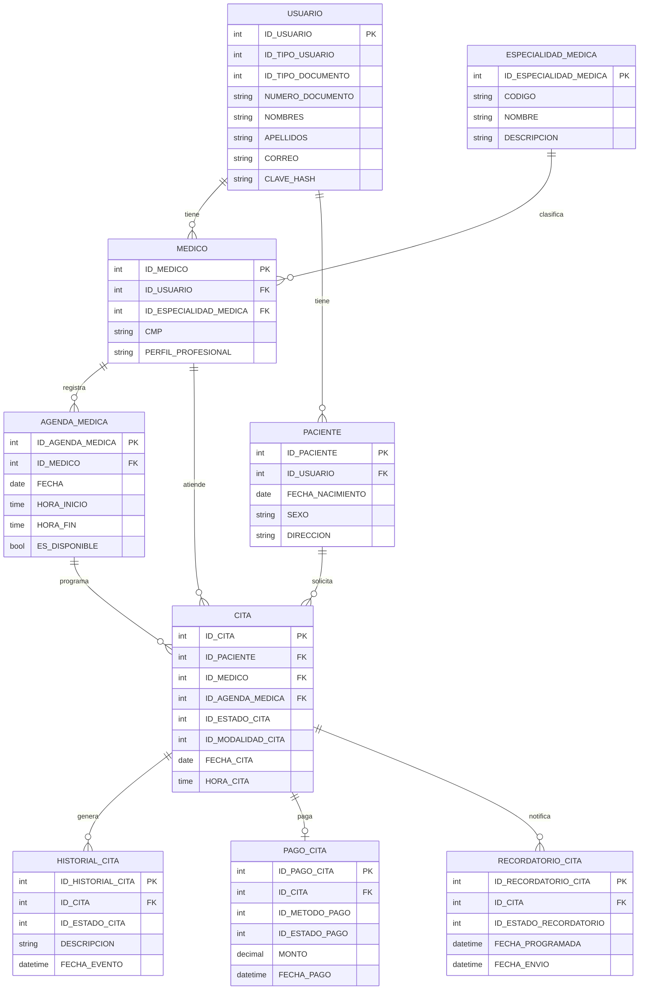

# Oftalvista

Sistema web para la gestion de usuarios, especialidades medicas, medicos, pacientes, agendas medicas, citas, pagos, historial de atencion y recordatorios. La solucion sigue una arquitectura cliente-servidor, con frontend en Angular y backend en ASP.NET Core 8 conectado a SQL Server Express.

## Descripcion General

Oftalvista fue construido para centralizar los procesos operativos de una clinica oftalmologica. El sistema permite administrar maestros del negocio, programar citas, controlar la disponibilidad medica, registrar pagos y mantener trazabilidad de los cambios efectuados sobre cada atencion.

## Arquitectura del Sistema

La arquitectura implementada responde a un esquema de tres capas:

1. Capa de presentacion:
   aplicacion web desarrollada en Angular.
2. Capa de negocio y servicios:
   API REST desarrollada en ASP.NET Core 8.
3. Capa de persistencia:
   acceso a datos con Entity Framework Core y LINQ sobre SQL Server Express.

### Diagrama de arquitectura tipo C4



## Modelo de Datos

La base de datos del sistema es `db_upc.oftalvista` y se organiza en dos esquemas:

- `maestro`: tablas maestras y de mantenimiento
- `transaccional`: tablas operativas del negocio

### Tablas principales

| Esquema | Tabla | Clave primaria | Descripcion |
|---|---|---|---|
| `maestro` | `usuario` | `ID_USUARIO` | Usuarios del sistema: administradores, medicos y pacientes. |
| `maestro` | `especialidad_medica` | `ID_ESPECIALIDAD_MEDICA` | Especialidades medicas disponibles. |
| `maestro` | `medico` | `ID_MEDICO` | Perfil profesional del medico y su especialidad. |
| `maestro` | `paciente` | `ID_PACIENTE` | Informacion del paciente. |
| `transaccional` | `agenda_medica` | `ID_AGENDA_MEDICA` | Bloques de disponibilidad del medico. |
| `transaccional` | `cita` | `ID_CITA` | Citas programadas entre medico y paciente. |
| `transaccional` | `historial_cita` | `ID_HISTORIAL_CITA` | Eventos y trazabilidad de la cita. |
| `transaccional` | `pago_cita` | `ID_PAGO_CITA` | Registro del pago de la cita. |
| `transaccional` | `recordatorio_cita` | `ID_RECORDATORIO_CITA` | Recordatorios asociados a la cita. |

### Relaciones principales

| Tabla origen | Campo FK | Tabla destino |
|---|---|---|
| `maestro.medico` | `ID_USUARIO` | `maestro.usuario` |
| `maestro.medico` | `ID_ESPECIALIDAD_MEDICA` | `maestro.especialidad_medica` |
| `maestro.paciente` | `ID_USUARIO` | `maestro.usuario` |
| `transaccional.agenda_medica` | `ID_MEDICO` | `maestro.medico` |
| `transaccional.cita` | `ID_PACIENTE` | `maestro.paciente` |
| `transaccional.cita` | `ID_MEDICO` | `maestro.medico` |
| `transaccional.cita` | `ID_AGENDA_MEDICA` | `transaccional.agenda_medica` |
| `transaccional.historial_cita` | `ID_CITA` | `transaccional.cita` |
| `transaccional.pago_cita` | `ID_CITA` | `transaccional.cita` |
| `transaccional.recordatorio_cita` | `ID_CITA` | `transaccional.cita` |

### Diagrama del modelo de datos



## Estructura del Proyecto

```text
Oftalvista/
├── 01 Client/
│   └── Oftalvista.Client.Public/   # Frontend Angular
├── Oftalvista.Api/                 # Backend ASP.NET Core 8
└── README.md
```

## Tecnologias Utilizadas

### Frontend

| Tecnologia | Version observada | Uso |
|---|---|---|
| Angular | 17.3.x | Framework principal de la SPA. |
| TypeScript | 5.4.x | Lenguaje de desarrollo del frontend. |
| Angular Router | 17.3.x | Navegacion y carga diferida. |
| Reactive Forms | 17.3.x | Formularios reactivos y validaciones. |
| Angular HttpClient | 17.3.x | Consumo de APIs REST. |
| Angular Material | 17.3.x | Componentes visuales. |
| Angular CDK | 17.3.x | Utilidades de interfaz. |
| RxJS | 7.8.x | Programacion reactiva. |
| SCSS | Nativo | Estilos del proyecto. |
| Zone.js | 0.14.x | Deteccion de cambios. |
| Angular CLI | 17.3.x | Build y servidor de desarrollo. |

### Backend

| Tecnologia | Version observada | Uso |
|---|---|---|
| .NET | 8.0 | Plataforma de ejecucion del backend. |
| ASP.NET Core Web API | 8.0 | Exposicion de endpoints REST. |
| C# | .NET 8 | Logica de negocio, entidades y controladores. |
| Entity Framework Core SqlServer | 8.0.0 | ORM y conexion con SQL Server. |
| LINQ | Integrado en C# | Consultas, filtros y proyecciones. |
| Inyeccion de dependencias | Nativa | Registro de servicios del backend. |
| CORS | Nativo | Integracion segura con Angular. |
| JSON | Estandar | Intercambio de datos por HTTP. |
| appsettings.json | Configuracion | Parametros de conexion y entorno. |

### Base de datos y herramientas

| Tecnologia | Uso |
|---|---|
| SQL Server Express | Motor de base de datos relacional. |
| Git | Control de versiones. |
| npm | Gestion de paquetes y compilacion del frontend. |
| dotnet CLI | Restauracion, compilacion y ejecucion del backend. |

## Caracteristicas Funcionales

- Gestion de usuarios
- Gestion de especialidades medicas
- Gestion de medicos
- Gestion de pacientes
- Agenda medica
- Registro y seguimiento de citas
- Historial de citas
- Pagos de citas
- Recordatorios de citas
- Autenticacion por correo y clave

## Configuracion de Desarrollo

### Frontend

- Ruta: `01 Client/Oftalvista.Client.Public`
- URL esperada del backend en desarrollo: `http://localhost:5000/api/v1`

### Backend

- Ruta: `Oftalvista.Api`
- API base: `http://localhost:5000`
- Base de datos de desarrollo: SQL Server Express local

## Comandos utiles

### Frontend

```bash
npm install
npm start
npm run build
```

### Backend

```bash
dotnet restore
dotnet build
dotnet run --project Oftalvista.Api
```

## Notas del Repositorio

Este repositorio ignora de forma intencional los siguientes directorios locales:

- `/.nuget`
- `/docs`
- `/skills`

Esto evita publicar caches locales, documentacion auxiliar temporal o skills de trabajo interno que no forman parte del codigo fuente principal del sistema.